# Sample AWS Lambda Project #

## Table of Contents ##
* [Introduction](#TOC-Introduction)
* [Key Features](#TOC-KeyFeatures)
* [Before You Begin](#TOC-BeforeYouBegin)
* [Installation](#TOC-Installation)
* [Running and Modifying the Function](#TOC-RunModify)
* [Versioning and Aliasing the Function](#TOC-VersionAlias)
* [License](#TOC-License)
* [Create AWS User to run Terraform](#TOC-CreateUser)

## <a name="TOC-Introduction"></a>Introduction ##

This project is a "Hello, World!" version of the architecture described in [this blog post](http://code.hootsuite.com/accelerating-cross-platform-development-with-serverless-microservices/). 

With it you can create an [AWS Lambda](https://aws.amazon.com/lambda/) function and surrounding IAM infrastructure with [Terraform](https://www.terraform.io/). 

The Lambda function is managed with [Gradle](https://gradle.org/) and [boto3](https://github.com/boto/boto3) scripts and run unit tests against your newly deployed function.

The Lambda function code can be found in the `src/main/java/com/hootsuite/example/lambda/SampleLambda.java` file. This Lambda code is meant to be a simple "Hello, World!" example which you can modify to your needs.
 
## <a name="TOC-KeyFeatures"></a>Key Features ##

This project allows you to:
* Create an AWS Lambda function
* Deploy code to the function from S3
* Manage the AWS infrastructure through Terraform
* Manage the Lambda function through gradle and boto
* Run Unit Tests locally and through the Lambda fucntion

## <a name="TOC-BeforeYouBegin"></a>Before You Begin ##

### AWS ###

You will need an Amazon AWS account, you can sign up [here](https://aws.amazon.com/account/). In order to create the resources in this project, you will need to have permissions to create infrastructure in this account.
 
*IMPORTANT* Following the steps in this project may incur a small cost to the associated AWS account.

### boto3 ###

The AWS Lambda function is managed with Gradle scripts invoking [boto3](https://github.com/boto/boto3) scripts. 

* If you do not have `python`, you will need to install it, instructions can be found [here](https://www.python.org/)
* If you do not have `pip`, you will need to install it, instructions can be found [here](https://pip.pypa.io/en/stable/installing/)
* You will need to install `boto3`.
** From your terminal, enter: `sudo pip install boto3==1.4.4`.

### pyyaml ###

This is a yaml parser for python, used to read the AWS credentials from the configuration files. 

* You will need to install `pyyaml`.
** From your terminal, enter: `sudo pip install pyyaml==3.12`.

### Terraform ###

The infrastucture in this project is managed using HashiCorp's [Terraform](https://www.terraform.io/)

* You will need to install `terraform`.
** You can download it from HashiCorp [here](https://www.terraform.io/downloads.html)
** On macOS, you can also install it with [brew](https://brew.sh/) by entering in the terminal: `brew install terraform`.

### Java ###

The AWS Lambda function in this project uses Java 8 and so you will need to install the Java 8 JDK.

* You can follow the installation instructions [here](http://www.oracle.com/technetwork/java/javase/downloads/jdk8-downloads-2133151.html)
* Alternatively, you can use the OpenJDK [here](http://openjdk.java.net/projects/jdk8/)

### AWS IAM ###

In order to run this project, you will need to create an IAM user with sufficient AWS management permissions.

See the [Create AWS User to run Terraform](#TOC-CreateUser) section of this README for details.

## <a name="TOC-Installation"></a>Installation ##

### 1. Creating an S3 Bucket and Folder for the AWS Lambda Resources ###

Here we will create an S3 bucket and folder to hold the AWS Lambda artifacts.

a. Choose a unique name for your S3 bucket, into which the Lambda files will be placed. The bucket name has to be unique across all buckets in AWS S3.

b. In the `gradle.properties` file, replace the `<your-bucket-name>` with a unique bucket name for the project.
    `bucketName=<your-bucket-name>`
    
c. From the root directory of the project, run `./gradlew createS3Resources`. This will create an S3 bucket with the name above, as well as a folder in the bucket for the Lambda resources.

d. After creating the bucket, you should place your bucket name into the `terraform/env/staging.tfvars` file, on the following line:
    `bucket = "<your-bucket-name>"`

Now we have an S3 bucket and folder, into which our Lambda code will be placed.

### 2. Building the initial Java artifact for AWS Lambda ###

Here we will build the `.zip` artifact of the AWS Lambda code.

a. From the root directory run `./gradlew clean buildZip` in the terminal. This will compile the AWS Lambda function into a .zip artifact which we will later upload to AWS Lambda.
 
b. The build should succeed and you should see `sample-lambda-1.0.0.zip` in the `build/distributions` directory.

Now we have an initial .zip artifact of our Lambda source code which will be uploaded to create the AWS Lambda function.

### 3. Running Terraform to create staging infrastructure ###

In this step we will create the staging infrastructure in AWS, including our Lambda function, as well as the IAM resources to invoke and manage it.

a. From the project root directory, enter `cd terraform` into the the terminal.

b. To use terraform to plan the infrastructure that needs to be created, run the following command in your terminal:
    `terraform plan --var-file="../aws_secrets.tfvars" -var-file="env/staging.tfvars"` 
    
c. Ensure that the plan says `Plan: 9 to add, 0 to change, 0 to destroy.` This means that 9 resources are to be created when we apply the plan.

d. If the plan is successful, apply it by entering the following command into the terminal:
    `terraform apply -var-file="../aws_secrets.tfvars" -var-file="env/staging.tfvars"`

e. If the apply is successful, you should see the following:

```
The state of your infrastructure has been saved to the path
below. This state is required to modify and destroy your
infrastructure, so keep it safe. To inspect the complete state
use the `terraform show` command.
```

Now we have created the infrastructure in AWS which will we use to run and manage the Lambda function.

### 4. Extracting the IAM user for invoking the AWS Lambda Function ###

Here we will extract the credentials from the newly created user which only has permissions to invoke the Lambda function. We will use this user with our Java test client to invoke the function.

a. In the terminal enter:
    `terraform show`
    
b. You can scroll through the output and you should see that two sets of access keys have been created.

c. Look for the following block with `sample_lambda_invoker` in the output, with `<id>` and `<password>` being the real id and password in your output:

```
aws_iam_access_key.sample_lambda_invoker:
  id = <id>
  secret = <secret>
  ses_smtp_password = <password>
  status = Active
  user = sample_lambda_invoker_staging
```

d. This user has been created to only invoke the Lambda function and so we need to place it in the Java code where the unit tests will eventually invoke our AWS Lambda function. 

e. Copy the value of the `<id>` and the `<secret>`.
f. Place them, in order, on line 16 of the `AwsLambdaCredentialsProvider` java class in the `src/test/java/com/hootsuite/example/lambda/environment/` folder.

g. The line should look like:

```
return new BasicAWSCredentials("<id>", "<secret>");
```

Replace the `<id>` with the generated id and `<secret>` with the generated secret.

Now we have given permissions to the unit tests to invoke our Lambda function.

### 5. Extracting the IAM user for managing the AWS Lambda Function ###

Here we will extract the user we use to manage the Lambda function. The user is named `sample_lambda_jenkins`. This is because in our production Lambda deployment, we are using [Jenkins](https://jenkins.io/) to run jobs which manage our Lambda code. The credentials generated here are embedded in our Jenkins machine. For this simple introduction, you will play the role of Jenkins, managing the AWS Lambda function yourself.

a. From the `terraform` directory, run the following command again:
    `terraform show`

b. Now look for the following block. 

```
aws_iam_access_key.sample_lambda_jenkins:
  id = <id>
  secret = <secret>
  ses_smtp_password = <password>
  status = Active
  user = sample_lambda_jenkins_staging
```

c. Again copy the `<id>` and `<secret>` values.
 
d. This time, we will place them in the `aws_credentials.yml` file. The file should look like: 
```
staging_access_key = "<id>"
staging_secret_key = "<secret>"

production_access_key = ""
production_secret_key = ""
```

e. Place your `<id>` and `<secret>` into the file where marked above. For now, ignore the production access key and secret key as we are only creating a staging environment in this example.

Now we have a user which has permissions to manage the Lambda function which will be used when we invoke the boto3 scripts through gradle tasks. 

### 6. Uploading the Artifact to S3 ###

Now that we have a user with permissions to do so, we will upload our artifact to S3.

a. Cd into the project's root directory. 

b. From the root project directory run the following command in the terminal:
    `./gradlew uploadStaging` 
   
* The artifact we compiled should now be uploaded to S3. 

### 7. Modifying our Lambda to pull the artifact from S3 ###

Currently, our AWS Lambda function uses an artifact uploaded directly to AWS Lambda. In order to effectively manage and version our Lambda function, we will need to change the function to pull code from the S3 bucket we previously created.

a. In the `terraform/main.tf` file. Comment out line 4 with `//` or `#`:

`   filename = "../build/distributions/sample-lambda-1.0.0.zip"`

b. Also uncomment lines 5 and 6 in the file. 

```
   s3_bucket = "${var.bucket}"
   s3_key = "sample_lambda/${var.env}/sample-lambda-1.0.0.zip"

```

c. Switch to the `terraform` directory in your terminal:
    `cd terraform`

d. We will now re-run the planning stage to change the infrastructure. Enter the following in the terminal:
    `terraform plan --var-file="../aws_secrets.tfvars" -var-file="env/staging.tfvars"` 
        
e. This time, you should only see that there is only 1 resource to change:

```
~ aws_lambda_function.sample_lambda
    filename:  "../build/distributions/sample-lambda-1.0.0.zip" => ""
    s3_bucket: "" => "<your bucket name>"
    s3_key:    "" => "sample_lambda/staging/sample-lambda-1.0.0.zip"


Plan: 0 to add, 1 to change, 0 to destroy.
```

f. If the plan is successful, apply it by entering the following command into the terminal:
    `terraform apply -var-file="../aws_secrets.tfvars" -var-file="env/staging.tfvars"`

g. If the apply is successful, you should see the following:

```
The state of your infrastructure has been saved to the path
below. This state is required to modify and destroy your
infrastructure, so keep it safe. To inspect the complete state
use the `terraform show` command.
```

Now we have our function set to pull artifacts from S3 to run. This means that we should no longer need terraform to manage our Lambda function. From now on we will only use gradle tasks which invoke boto3 scripts underneath.

## <a name="TOC-RunModify"></a>Running and Modifying the Function ##

### 8. Running the Tests to ensure deployment ###

Here we will run the unit tests from `src/test/java/com/hootsuite/example/lambda/SampleTest.java`. These tests can be configured to run locally (without going through the Lambda function) or end-to-end (through the Lambda function).

a. Switch to the root directory of the project in your terminal. 

b. From the project root directory, run the following command in the terminal:
    `./gradlew clean -PtestEnvironment=LOCAL test`.

You should see that two of the local unit tests pass and two fail. You can look at the `src/main/java/com/hootsuite/example/lambda/SampleLambda.java` file. Right now we're only outputting either "ZERO" or "GREATER THAN ZERO" based on the input. We'll fix those other two tests later.

c. From the project root directory, run `./gradlew clean -PtestEnvironment=STAGING test`.

These tests are hitting the newly deployed Lambda! Again two will pass and two fill fail. These are the first invocations of your Lambda function!

### 9. Modifying the Lambda function to fix the breaking tests ###

Now we will modify the Lambda function code to exhibit the expected behavior.

a. Now we'll change the Lambda function. In `src/main/java/com/hootsuite/example/lambda/SampleLambda.java` comment out line 9 and uncomment lines 11-16 inlcusive, so that the lines look like the following:

```
//         return (request == 0) ? "ZERO" : "GREATER THAN ZERO";
        // TODO STEP 9 Comment out the line above and uncomment the lines below
        switch (request) {
            case 0: return "ZERO";
            case 2: return "TWO";
            case 3: return "THREE";
            default: return "GREATER THAN ZERO";
        }

```

Now we're adding the expected behavior of outputting the numbers "TWO" and "THREE". In the real world this could be fixing a bug that we've previously deployed.

b. Switch to the project root directory in the terminal.

c. From the project root directory, run `./gradlew clean -PtestEnvironment=LOCAL test`.

The tests should all now pass since we've fixed them locally.

d. From the project root directory, run `./gradlew clean -PtestEnvironment=STAGING test`.

The two tests should still be failing since we haven't uploaded the new code to AWS Lambda.

### 10. Updating the AWS Lamdba code ###

a. Update the version of the code in the `build.gradle` file on line 6 to 1.0.1.

```
buildscript {
    ext {
        version = '1.0.1'
```


b. From the project root directory, run `./gradlew clean updateFunctionCodeStaging`.

The above command will build a new zip file, version 1.0.1 and then upload it to S3. Our AWS Lambda Function will be updated to pull the new code from S3. 
 
Our unit-testing client is set to invoke the latest version of the Lambda Function code, later we will see how we can lock clients to Aliases and versions. 

This one command is all that is needed to update the Lamdba function code, after the initial runs, Terraform is not needed to manage the function.

c. From the project root directory, run `./gradlew clean -PtestEnvironment=STAGING test`.

The tests should pass now with the new version of the function code deployed.

## <a name="TOC-VersionAlias"></a>Versioning and Aliasing the Function ##

// TODO More to come with aliases.

## <a name="TOC-License"></a>License ##

This project is released under the Apache License, Version 2.0. See [LICENSE](LICENSE) for details.

## <a name="TOC-CreateUser"></a>Create AWS User to run Terraform

### 1. Sign into the AWS Console and navigate to IAM Management for US-East-1 ###

a. In a browser window, navigate to `https://console.aws.amazon.com/console/home`. Sign into the console.

b. After signing in, navigate to `https://console.aws.amazon.com/iam/home?region=us-east-1#/home`. This is where we will create the user we need to run Terraform to manage our AWS Infrastructure.

Now that you are signed in, we create the user.

### 2. Create the User ###

a. Click on `Users` in the side bar, see the image below.


b. Click on `Add user` as shown in the image below.

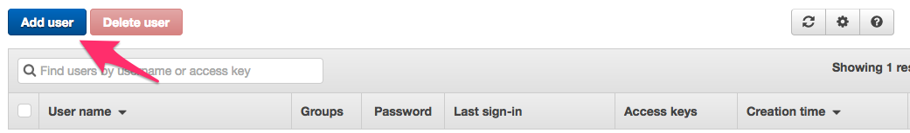

c. Type the name of the user `sample_lambda_manager` into the User name field and check the `Programmatic access` box. See the image below.

d. Click the `Next: Permissions` box to proceed.

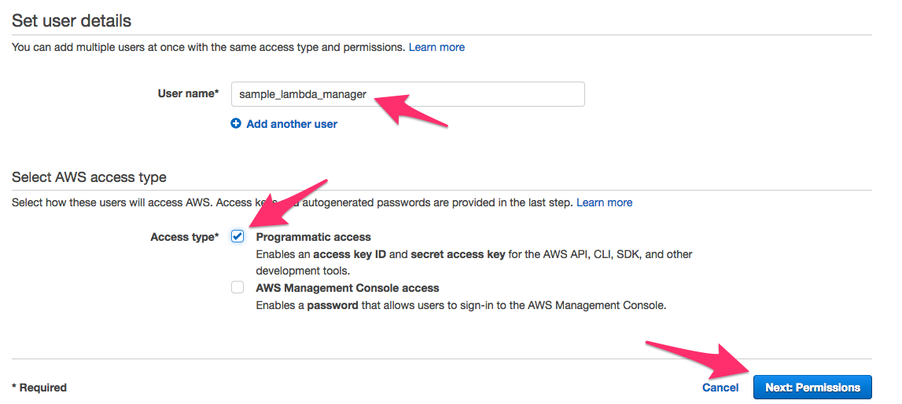

e. As shown in the image below, tap on `Attach existing policies directly`.

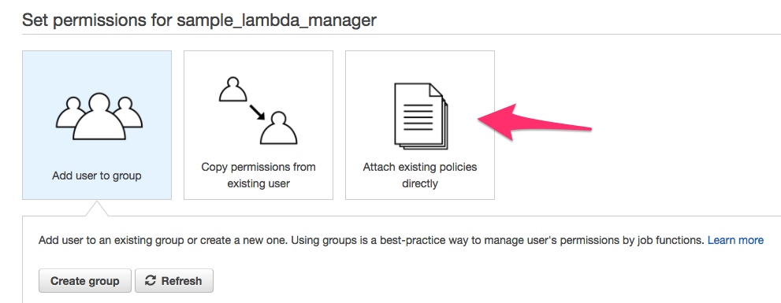

f. Now click the `Create policy` button as shown below.
 
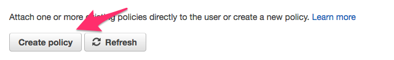

This should open a new browser window where we will create the policy that your Terraform user will need to create and manage the project infrastructure.

### 3. Creating the Policy to Attach to the Terraform User ###

a. In the new tab, click `Select` next to `Create Your Own Policy` as shown below.

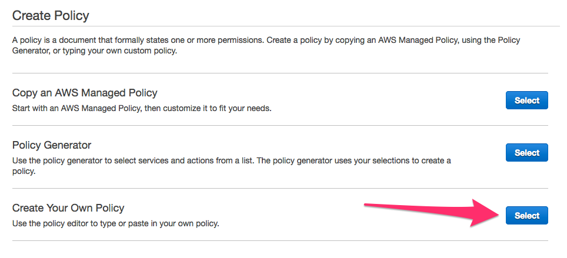

b. In the next screen, enter the name of the policy `sample_lambda_terraform` and a short description. This is shown in the image below.

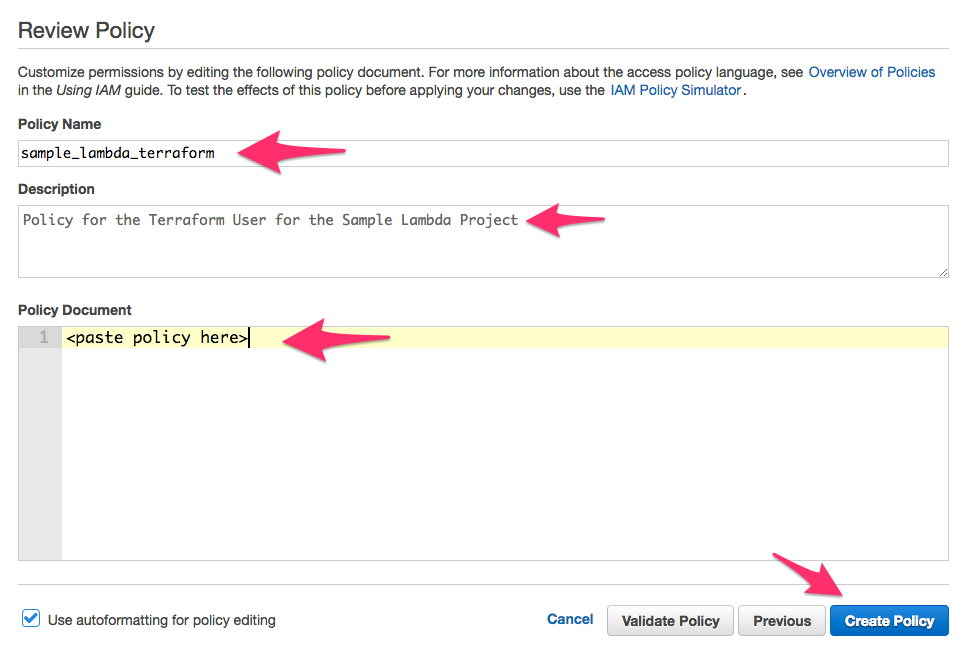

c. Where it says `<paste policy here>`, paste the JSON snippet below.

```json
{
    "Version": "2012-10-17",
    "Statement": [
        {
            "Sid": "LambdaCreateLogs",
            "Effect": "Allow",
            "Action": [
                "logs:CreateLogGroup",
                "logs:CreateLogStream",
                "logs:PutLogEvents"
            ],
            "Resource": "*"
        },
        {
            "Sid": "S3Management",
            "Effect": "Allow",
            "Action": [
                "s3:CreateBucket",
                "s3:PutObject",
                "s3:GetBucketLocation",
                "s3:GetObject",
                "s3:GetObjectAcl",
                "s3:GetObjectVersion",
                "s3:ListAllMyBuckets",
                "s3:ListBucket",
                "s3:ListBucketVersions",
                "s3:PutObject"
            ],
            "Resource": [
                "*"
            ]
        },
        {
            "Sid": "Stmt1490105011000",
            "Effect": "Allow",
            "Action": [
                "lambda:AddPermission",
                "lambda:CreateFunction",
                "lambda:GetFunction",
                "lambda:GetFunctionConfiguration",
                "lambda:CreateAlias",
                "lambda:DeleteAlias",
                "lambda:GetAlias",
                "lambda:InvokeFunction",
                "lambda:ListAliases",
                "lambda:ListVersionsByFunction",
                "lambda:PublishVersion",
                "lambda:UpdateAlias",
                "lambda:UpdateFunctionCode"
            ],
            "Resource": [
                "*"
            ]
        },
        {
            "Sid": "Stmt1490105149000",
            "Effect": "Allow",
            "Action": [
                "iam:AttachRolePolicy",
                "iam:AttachUserPolicy",
                "iam:CreateAccessKey",
                "iam:CreatePolicy",
                "iam:CreatePolicyVersion",
                "iam:CreateRole",
                "iam:CreateUser",
                "iam:GetRole",
                "iam:GetRolePolicy",
                "iam:GetUser",
                "iam:GetUserPolicy",
                "iam:ListAccessKeys",
                "iam:ListPolicies",
                "iam:ListUserPolicies",
                "iam:ListUsers"
            ],
            "Resource": [
                "*"
            ]
        }
    ]
}
```

d. Now click on the `Create Policy` button and we are done creating the policy, you can close the tab.

### 4. Attaching the Policy the the Terraform User ###

Now that we created the policy we will attach it to the user. 

a. Click `Refresh` to refresh the list of policies to include our newly created policy.

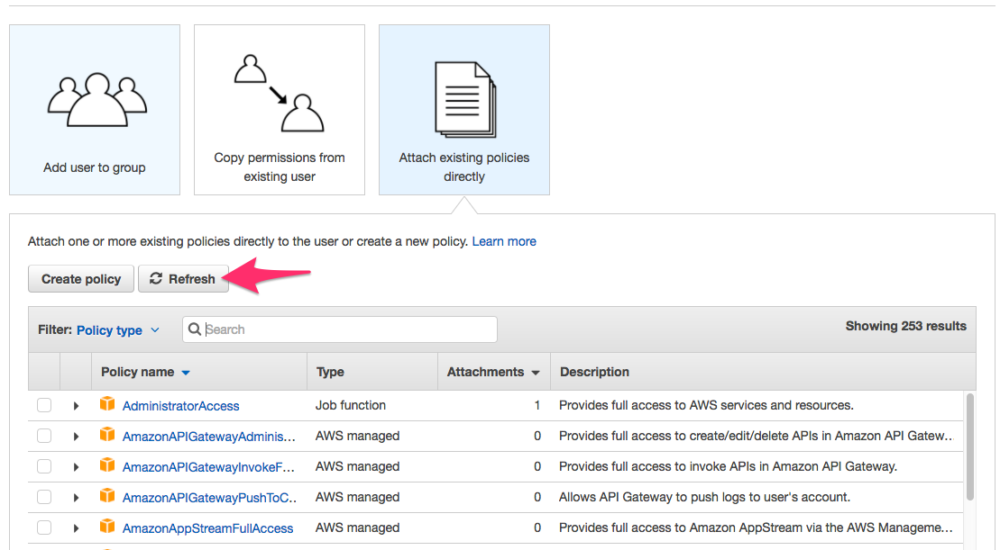

b. Type the name of our policy as as shown below: `sample_lambda_terraform`.

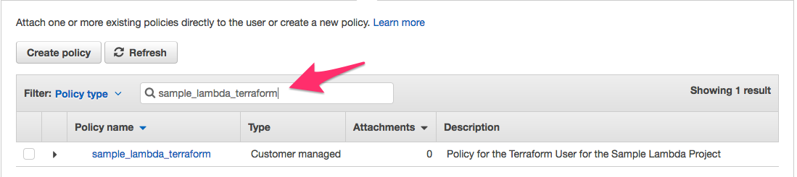

c. Check the box next to the policy as shown below and then click `Next: Review`.

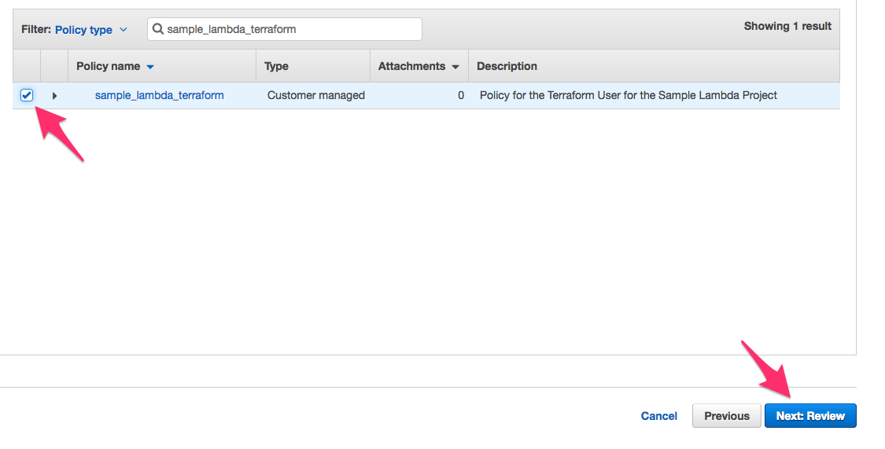

d. On the next screen, click `Create User` as shown below.

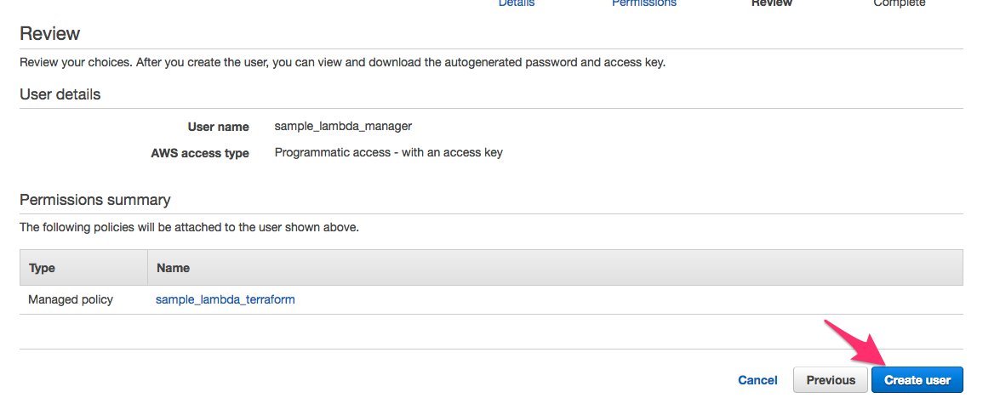

Now we have our user, we only need to copy the keys to this project.

### 5. Copy the newly created keys to this project ###

a. As shown in the image below, copy the `Access key ID` of the newly created user.
 
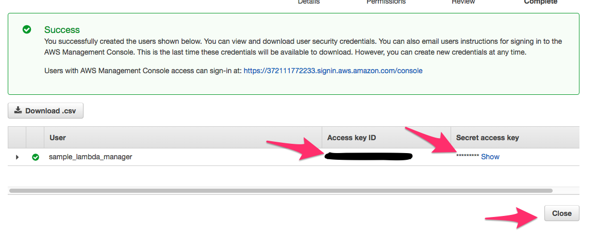

b. Open up the `aws_secrets.tfvars` file in the root directory of this project and replace the `<your_access_key>` with your copied access key. The file is shown below:

```
access_key = "<your_access_key>"
secret_key = "<your_secret_key>"

```

c. As shown in the image above, click `Show` to reveal the Secret Key of the user, copy it and place it into the `<your_secret_key>` in the file as well.

d. Click `Close` and you're finished creating your IAM user to manage AWS infrastructure with Terraform! You should now be able to proceed with the [Installation](#TOC-Installation) section above.
